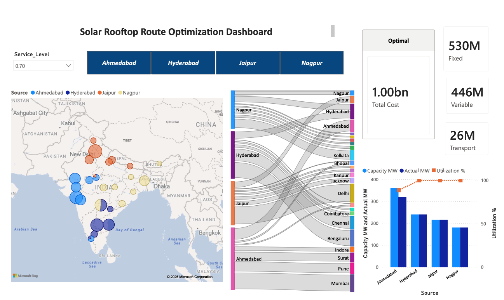

# Solar Supply Chain Network Optimization using MILP and Power BI

## Project Overview

This project develops a Mixed Integer Linear Programming (MILP)-based supply chain network optimization model for rooftop solar distribution across major Indian cities.

The model determines the optimal allocation of manufacturing facilities to demand locations while minimizing:

- Transportation Cost
- Variable Manufacturing Cost
- Fixed Facility Operating Cost

The project also evaluates multiple service-level scenarios to analyze the trade-off between customer service and total network cost.

---

## Business Problem

India’s rooftop solar market is expanding rapidly due to increasing renewable energy adoption and government initiatives. However, solar manufacturers and distributors face significant operational challenges in deciding:

- Where manufacturing/assembly facilities should operate
- How regional demand should be allocated
- How transportation costs can be minimized
- How service levels impact total network cost

This project simulates a realistic supply chain network design problem where candidate manufacturing locations are pre-identified, and the optimization model determines the most cost-efficient network configuration.

---

## Objective

The primary objective of this project is to minimize total supply chain cost while satisfying regional rooftop solar demand across India.

The optimization model considers:

- Transportation cost
- Production cost
- Fixed facility operating cost
- Capacity constraints
- Minimum utilization constraints
- Service-level requirements

---

## Optimization Logic

The problem is formulated as a Mixed Integer Linear Programming (MILP) model.

### Decision Variables

- Shipment quantity from manufacturing facility to demand city
- Binary facility activation variable

### Objective Function

Minimize:

- Transportation Cost
- Variable Production Cost
- Fixed Facility Cost

### Constraints

- Demand fulfillment constraints
- Facility capacity constraints
- Minimum utilization constraints
- Service-level constraints
- Oversupply prevention constraints

---

## Technologies Used

- Python
- PuLP
- Pandas
- NumPy
- Geopy
- Power BI
- MILP Optimization

---

## Key Features

- Facility location optimization
- Transportation cost engineering
- Geographic distance modeling
- Service-level scenario analysis
- Facility utilization analysis
- Sankey flow visualization
- Geographic demand allocation dashboard

---

## Scenario Analysis

The model evaluates multiple service-level scenarios ranging from:

- 40%-100%

This helps analyze the trade-off between:

- Customer service
- Facility utilization
- Total network cost
- feasible/infeasible

---

## Dashboard Preview

### Network Allocation Dashboard



---

## Key Insights

## Key Insights and Strategic Conclusions

### 1. Strategic Hub Locations Reduced Overall Network Cost

The optimization model identified Ahmedabad, Hyderabad, Jaipur, and Nagpur as the most economically efficient manufacturing hubs due to their geographic positioning and regional accessibility.

Ahmedabad emerged as a particularly strong node for balancing regional demand coverage with operational efficiency.

---

### 2. Fixed and Variable Production Costs Were the Primary Cost Drivers

The analysis showed that fixed facility operating costs and variable production costs constituted the majority of total network expenditure, while transportation cost represented a comparatively smaller share.

This indicates that:
- Facility utilization
- Capacity planning
- Production efficiency

have a significantly larger impact on network economics than transportation optimization alone.

---

### 3. Higher Service Levels Increased Total Network Cost

Scenario analysis demonstrated that increasing service levels led to higher total cost due to additional production and facility utilization requirements.

The results highlight the trade-off between:
- Customer responsiveness
- Operational efficiency
- Cost optimization

An optimized mid-range service level provided the best balance between cost and fulfillment performance.

---

### 4. Facility Utilization Strongly Influenced Efficiency

Facilities operating near optimal utilization levels delivered superior cost performance, while underutilized facilities increased fixed cost burden.

This suggests that future expansion decisions should prioritize scalable, high-demand regional hubs rather than excessive decentralization.

---

## Strategic Recommendation

The recommended strategy is to operate a semi-centralized manufacturing network with optimized regional allocation flows and high facility utilization.

This approach enables:
- Lower operating cost
- Better production efficiency
- Scalable expansion
- Balanced service performance

while supporting long-term growth in the rooftop solar market.

------


## Repository Structure

```text
solar-network-optimization-milp/
│
├── notebooks/
│   └── solar_network_optimization.ipynb
│
├── data/
│   ├── demand.csv
│   ├── plants.csv
│   └── circuity.csv
│
├── dashboard/
│   └── network_solar.pbix
│
├── images/
│   ├── dashboard.png
│   └── sl vs cost tradeoff.png
│
├── README.md
├── requirements.txt
└── .gitignore